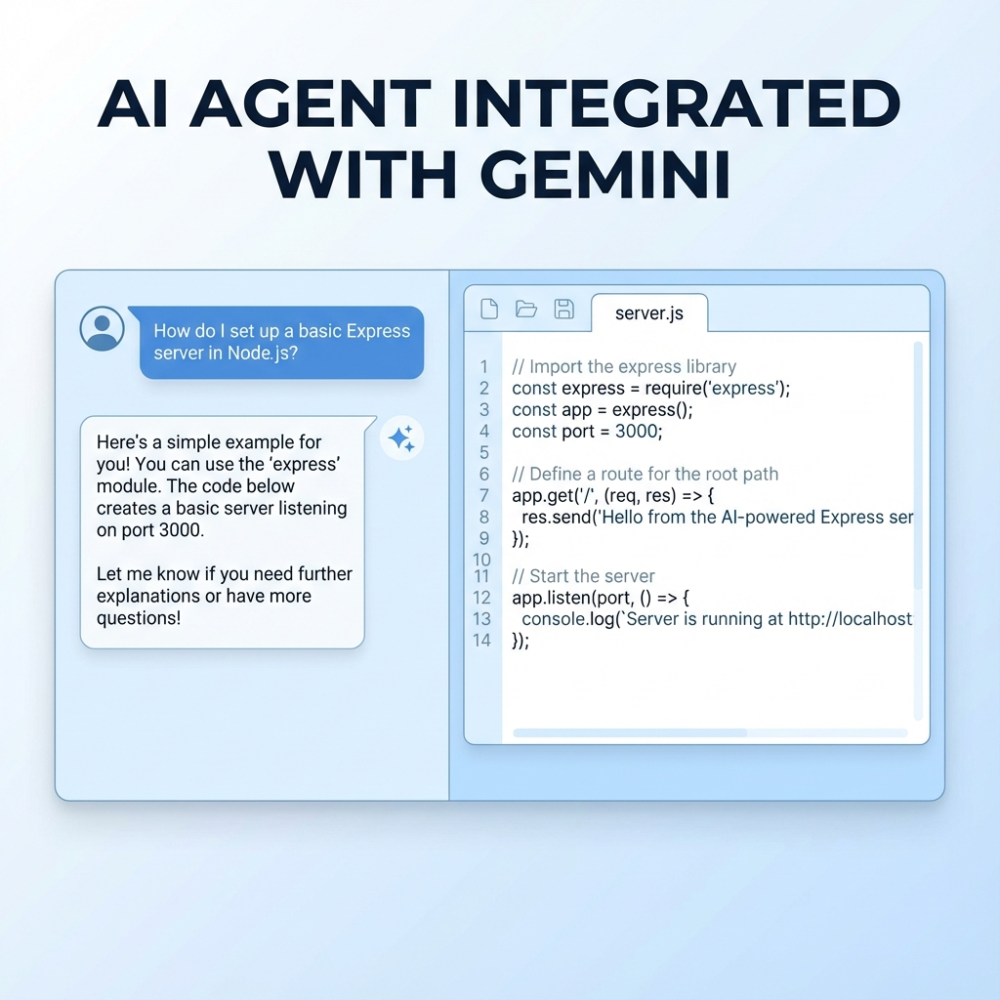

# 🤖 AI Agent - Collaborative AI Code Editor



> **An intelligent, real-time collaborative code editor powered by Google Gemini AI and WebContainers.**

---

## 🚀 Project Objective

**AI Agent** is designed to revolutionize the way developers prototype and build applications. It solves the problem of friction in setting up development environments and coding alone. By integrating **Google's Gemini AI** directly into a browser-based IDE (similar to VS Code), users can generate entire file structures and code snippets just by chatting.

Combined with **WebContainers**, it allows users to **run Node.js applications directly in the browser** without any local setup. Real-time collaboration features enable teams to work together seamlessly on the same project.

---

## ✨ Key Features

Based on the current codebase, the system implements:

### 🧠 AI-Powered Coding
- **Chat with @ai**: Users can tag `@ai` in the chat to trigger the Gemini AI model.
- **Automated File Generation**: The AI can generate complex file trees and code content (e.g., "Create a detailed express server structure") which are automatically mounted into the editor.
- **Intelligent Context**: The AI acts as an expert developer, following best practices and modular coding styles.

### 💻 Browser-Based IDE
- **In-Browser Execution**: Uses **WebContainers** to run `npm install` and `npm start` directly inside the browser.
- **Live Preview**: Integrated iframe to view the running application in real-time.
- **File System Simulation**: Create, edit, and organize files in a virtual file system.
- **Syntax Highlighting**: robust code editor experience with language support.

### 🤝 Real-Time Collaboration
- **Live Chat**: Team members can communicate in real-time within the project.
- **Collaborative Editing**: Changes to files are synced (via Socket.io updates).
- **Project Sharing**: Add collaborators to your projects by email.

### 🔐 Security & User Management
- **Authentication**: Secure Login and Registration using JWT (JSON Web Tokens).
- **Protected Routes**: Middleware ensures only authorized users access projects.

---

## 🏗️ High-Level Architecture

The system follows a modern **Client-Server** architecture enhanced with Peer-to-Peer capabilities for collaboration.

1.  **Client (Frontend)**: built with **React** and **Vite**. It handles the UI, acts as the socket client, and runs the **WebContainer** instance.
2.  **Server (Backend)**: built with **Node.js** and **Express**. It manages the MongoDB database, handles API requests, and brokers real-time events via **Socket.io**.
3.  **AI Engine**: The backend acts as a gateway to **Google GenAI (Gemini)**, processing prompts and ensuring responses are formatted as structured JSON for the frontend to consume.
4.  **Real-Time Layer**: **Socket.io** manages rooms (projects) to broadcast messages and AI responses to all connected users.

---

## 🛠️ Tech Stack

### **Frontend**
- **React (Vite)**: For a fast, reactive user interface.
- **Tailwind CSS**: For modern, responsive styling.
- **Socket.io-client**: For real-time communication with the server.
- **@webcontainer/api**: To execute Node.js code securely inside the browser.
- **Axios**: For handling HTTP requests.
- **Markdown-to-JSX**: To render chat messages and AI responses cleanly.

### **Backend**
- **Node.js & Express**: Robust server framework.
- **MongoDB (Mongoose)**: NoSQL database for flexible data storage (Users, Projects).
- **Socket.io**: Real-time event engine.
- **Redis (ioredis)**: Used for performance/caching (detected in capabilities).
- **Google GenAI SDK**: Interface for the Gemini AI model.
- **JWT & Bcrypt**: For secure authentication and password hashing.

---

## 📂 Folder Structure

```
AI-Agent/
├── Backend/                 # Server-side logic
│   ├── app.js               # Express app config
│   ├── server.js            # Server entry point, Socket.io setup
│   ├── controllers/         # Logic for Users, Projects, AI
│   ├── models/              # Mongoose Schemas (User, Project)
│   ├── routes/              # API Endpoints
│   ├── services/            # Business logic (AI service, Redis)
│   ├── middleware/          # Auth middleware
│   └── database/            # DB Connection setup
│
├── Frontend/                # Client-side application
│   ├── src/
│   │   ├── config/          # Axios, Socket, WebContainer configs
│   │   ├── context/         # User global state
│   │   ├── routes/          # App routing
│   │   ├── screens/         # Pages (Home, Login, Project)
│   │   └── App.jsx          # Root Component
│   ├── vite.config.js       # Vite configuration (Proxy, Headers)
│   └── index.html           # Entry HTML
│
└── README.md                # Project Documentation
```

---

## ⚙️ Setup & Installation Guide

### Prerequisites
- **Node.js** (v18+ recommended)
- **MongoDB** (Local or Atlas URI)
- **Google Gemini API Key**

### 1️⃣ Backend Setup
1.  Navigate to the backend folder:
    ```bash
    cd Backend
    ```
2.  Install dependencies:
    ```bash
    npm install
    ```
3.  Create a `.env` file in `Backend/` with the following:
    ```env
    PORT=MY_PORT
    MONGO_URI=your_mongodb_connection_string
    JWT_SECRET=your_jwt_secret_key
    GOOGLE_API_KEY=your_gemini_api_key
    REDIS_URL=your_redis_url (optional if using Redis)
    ```
4.  Start the server:
    ```bash
    npm start
    # or for development
    npm run dev
    ```

### 2️⃣ Frontend Setup
1.  Navigate to the frontend folder:
    ```bash
    cd Frontend
    ```
2.  Install dependencies:
    ```bash
    npm install
    ```
3.  Create a `.env` file in `Frontend/` (if not using proxy):
    ```env
    VITE_API_URL="http://localhost:PORT"
    ```
    *(Note: The project uses a Vite proxy in `vite.config.js` to handle headers for WebContainers)*
4.  Start the development server:
    ```bash
    npm run dev
    ```

---

## 📖 Usage Guide

1.  **Register/Login**: Create an account to access the dashboard.
2.  **Create Project**: Click "New Project" to start a fresh workspace.
3.  **Chat with AI**: In the chat box, type `@ai Create an express server`.
    - The AI will generate the file tree.
    - Click on files to view content.
4.  **Run Code**:
    - Open the terminal/commands panel.
    - Click **Run** to execute `npm install && npm start` inside the WebContainer.
    - View the output in the embedded browser preview.
5.  **Collaborate**:
    - Click "Add Collaborator" and select a user to add them to the project.
    - Chat in real-time to discuss changes.

---

## 🏆 Industry-Standard Practices Followed

- **MVC Architecture**: Clear separation of concerns in the Backend (Models, Views/Routes, Controllers).
- **Service Layer Pattern**: Business logic (like AI generation) is isolated in services.
- **Secure Authentication**: Implementation of JWT and Bcrypt for security.
- **Environment Management**: Sensitive keys are kept in `.env` files.
- **Modern React Patterns**: Usage of **Context API** for state management and functional components.
- **COOP/COEP Headers**: Proper configuration of Cross-Origin headers to enable `SharedArrayBuffer` for WebContainers.

<!-- 
## 🤝 Contribution Guidelines

1.  Fork the repository.
2.  Create a new branch (`git checkout -b feature/AmazingFeature`).
3.  Commit your changes (`git commit -m 'Add some AmazingFeature'`).
4.  Push to the branch (`git push origin feature/AmazingFeature`).
5.  Open a Pull Request.

---

## 📄 License

Distributed under the MIT License. See `LICENSE` for more information.

---

## 📞 Contact

Project Link: [https://github.com/yourusername/ai-agent](https://github.com/yourusername/ai-agent) -->
